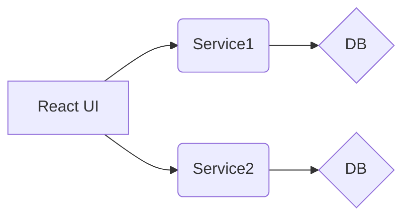

# Getting Started with Create React App

This project was bootstrapped with [Create React App](https://github.com/facebook/create-react-app).

# React UI

React UI with typescript for the post and comments microservice in this repository.Used both class based and functional react components. WIP project..

[comment service](https://github.com/cane-r/comment-service)
[post service](https://github.com/cane-r/post-service)
# How to run in dev : 
npm i start

# How to run in prod build : 
npm i run build && serve -s build

## diagrams

v0 current


v1 ..WIP/TBD later..
```mermaid
graph LR
A[React UI] --> B(Gateway)
B --> C(Service1)
B --> D(Service2)
C --> E{DB}
D --> F{DB}